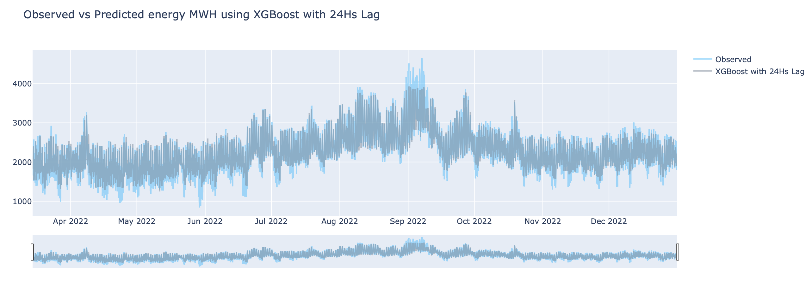

# Energy Prediction by the Hour
Danayt Aman. November 17,2023
-2.png)
# Project Overview
This project aims to predict energy consumption by the hour using machine learning techniques. Matching supply to demand is of utmost importance in the energy sector, it ensures the stability and reliability of power grid. The goal is to develop a model that can accurately forecast energy usage, which can be valuable for various applications such as energy management, demand planning, and cost optimization. 

## Data Understanding 

The project utilizes a dataset containing historical energy consumption by the hour. The dataset includes features such as date, time, weather conditions, and other relevant variables that were engineered from the time stamp and calendar such as holidays, working days and lag variables as time series prediction are influenced by previes times with certain weigh assigned to each historical lag. The dataset is preprocessed and cleaned to handle missing values, outliers, and other data quality issues. Weather data was retrieved from [NOVA](https://www.ncei.noaa.gov) and consumption data was retrieved from [CAISO](http://www.caiso.com/planning/Pages/ReliabilityRequirements/Default.aspx), the website has data from 2019, and that was the starting point of this timeseries project ending at the end of 2022 with posibly using 2023 data as a fresh testing set.

## Project Structure

The project is structured as follows:

### Preprocessing:
Cleaning: We start with data cleaning which involves Handling missing using the previous hour or interlope method which finds the average from surrounding hours. And resampling our weather data by the hour to merge with the energy consumption data.

Testing for Stationary : Time Series modeling is a bit different than regression modeling, because it has a moving average, meaning even though the yearly average smoothes out there’s a constant movement within the year, month, day and hourly intervals and this can be done using something called the adfuller test, with a p value lower than 0.05 insinuating that our data is stationary. 

Feature engineering: Since holidays are not accounted for we imported calendar and included a holiday as categorical indicator, to use certain time modeling algorithms such as SARIMAX and LSTM, I also added a fourier transformation, which is a mathematical model that helps pick on certain signals such as seasonal or hourly peaks. And since time series forecasting depends on previous events, I included lag variables for regression models, which is the delay or gap between an event and its effect, in this case we used a 24hours gap between hours and to predict the next hour. 

Next steps include splitting data into train and test set, we trained our data from the first of 2019 until march of 2022, 6pm and tested on the most recent data which was 20% of the whole data. I then encoded categorical features and scaled the numeric features so our data is handled with appropriate weight.

### Model Development
Train and evaluate various machine learning models to predict energy consumption. This includs regression models such as Random forest, elastic net, decision tree-based models such as XGBoost. Timeseries models such as SARIMAX and FB Prophet were also used in this project along with advanced techniques like LTSM neural networks.
   
All models error percentage were on average different by about 1.6% between the test and train and not significantly large to indicate overfitting or underfitting, of course this was a result of the tuning process with each model to find the optimal setting to get constant score between both test and train sets. This was especially important with the tree based algorithm, RandomForest and XGBoost as they are known to be greedy algorithms which are prone to overfitting, having great results on the training set and performing poorly on unseen data. Each model above was tested with and without weather variable, all performed better with weather included

Models were evaluated against a persistent forecasting baseline model which repeats the previous hour values and is sometimes hard to beat, which performed at 14%. All models performed better than the baseline except the LSTM model which took much longer time to run and not worth the computational time. 

Conclusion

Based on this analysis we can see how XGBoost does very well on capturing the seasonality and trends components of our time series data. Sarimax took a lot of time to train as well as LSTM, and i wouldn't recommend for hourly prediction. Sarimax did perform better for short term prediction, like a week into the future but XGBoost and other regressor models utilized in this project performed better and at a much less computation time.

For XGBoost the recommended hyperparameters are:

learning rate :0.1
Objective :reg:linear
max_depth :7
n-estimators :100
colsample bytree :0.7
Model Evaluation:

Mean Absolute Error: 147.44
Mean Squared Error: 42567.02
Root Mean Squared Error: 206.32
Mean Absolute Percentage Error: 6.71%
Variance Score: 0.78

That means our model is on average off the actual value by about 6.71%, which is around 147.44 MWH and compared to the average hourly consumption rate, this is not a bad outcome. Especially when we compare it to our baseline model which had a 14.07% error percontage and was on average off the actual value by 317.36 MWH.

# Limitations
This project did not account for solar energy and the time used being during covid where lockdown had an effect on energy consumption and might not be an appropriate representation of the county's usual data as yearly trend decreses from 2019 to 2022 and picks up from there. The data set used also doen't include all forcasting requirements such as solar, EV ownership or economic condition. 

# Next Steps
* Include solar, EV, and economic condition for long term forcasting.
* Account for residential and industrial presence 
* Deploy Model for real time predictions

## Dependencies

The project relies on the following libraries:

- Python 3.x
- NumPy
- Pandas
- Scikit-learn
- Matplotlib
- Seaborn

## Usage

To run the project, follow these steps:

1. Clone the repository:

git clone (git@github.com:Danayt09/Phase_5_Energy.git)

2. Install the required dependencies:

pip install -r [requirements.txt](https://github.com/Danayt09/Phase_5_Energy/blob/main/requirement.txt)

3. Run the Jupyter notebook or Python scripts in the specified order:

* [CleaningNotebook](https://github.com/Danayt09/Phase_5_Energy/tree/main/Cleaning_Notebooks)
* [ModelingNotebook](https://github.com/Danayt09/Phase_5_Energy/blob/main/Modeling_Notebook.ipynb)

# LinkedIn
Danayt Aman   

